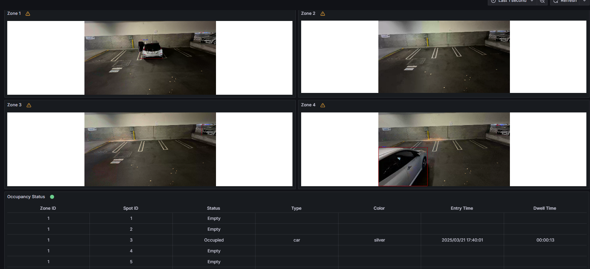

# Get Started

The Smart Parking application uses AI-driven video analytics to optimize parking management. It provides a modular architecture that integrates seamlessly with various input sources and leverages AI models to deliver accurate and actionable insights.

By following this guide, you will learn how to:
- **Set up the sample application**: Use Docker Compose to quickly deploy the application in your environment.
- **Run a predefined pipeline**: Execute a pipeline to see smart parking application in action.

## Prerequisites
- Verify that your system meets the [minimum requirements](./system-requirements.md).
- Install Docker: [Installation Guide](https://docs.docker.com/get-docker/).
- Install Python pip and venv packages
```bash
  sudo apt update && sudo apt install -y python3-pip python3-venv
```

## Set up and First Use

1. **Download the Compose File**:
    - Download the Docker Compose file and configuration:
      ```bash
        git clone https://github.com/intel/metro-ai-suite.git
      ```

2. **Navigate to the Directory**:
    - Go to the directory where you saved the Compose file:
      ```bash
      cd edge-ai-suites/metro-ai-suite/smart-parking/
      ```

3. **Update the IP Address**:
      
      - Open the `.env` file:
        ```bash
        nano .env
        ```
      - Modify the HOST_IP variable in the .env file to your actual host IP address.
        ```bash
        HOST_IP=10.10.10.10
        ```
      - Save and close the file.

4. **Update Dashboard with your Host IP Address and Use Case**
    ```bash
        ./update_dashboard.sh
    ```

5. **Download the Model and Video files**
    ```bash
        ./install.sh
    ```

6. **Start the Application**:
    - Run the application using Docker Compose:
      ```bash
      make start
      ```

7. **Verify the Application**:
    - Check all containers are in Running state:
      ```bash
      docker ps
      ```

8. **Access the Application**:
    - Open a browser and go to `http://localhost:3000` to access the Grafana dashboard.
        - Change the localhost to your host IP if you are accessing it remotely.
    - Log in with the following credentials:
        - **Username:** `admin`
        - **Password:** `admin`
    - Check under the Dashboards section for the default dashboard named "Video Analytics Dashboard".
    

9. **Run a Predefined Pipeline**:
    - Run the following commands to start the pipeline
        ```bash
        ./run_sample.sh
        ```
    - **Expected Results**:
    - The dashboard displays detected cars.
    - 

## Stop the Containers

1.  To stop the application, use the following commands:

    ```bash
    make stop
    ```

## Next Steps
- [How to Customize the Application](how-to-customize-application.md)

## Troubleshooting

1. **Containers Not Starting**:
   - Check the Docker logs for errors:
     ```bash
     docker compose logs
     ```

2. **No Video Streaming on Grafana Dashboard**
    - Go to the Grafana "Video Analytics Dashboard".
    - Click on the Edit option (located on the right side) under the WebRTC Stream panel. 
    - Update the URL from `http://localhost:8083` to `http://host-ip:8083`.

3. **Failed Grafana Deployment** 
    - If unable to deploy grafana container successfully due to fail to GET "https://grafana.com/api/plugins/yesoreyeram-infinity-datasource/versions": context deadline exceeded, please ensure the proxy is configured in the ~/.docker/config.json as shown below:

      ```bash
              "proxies": {
                      "default": {
                              "httpProxy": "<Enter http proxy>",
                              "httpsProxy": "<Enter https proxy>",
                              "noProxy": "<Enter no proxy>"
                      }
              }
      ```

    - After editing the file, remember to reload and restart docker before deploying the microservice again.

      ```bash
      systemctl daemon-reload
      systemctl restart docker
      ```

## Supporting Resources
- [Docker Compose Documentation](https://docs.docker.com/compose/)
- [Edge Video Analytics Microservice](https://docs.edgeplatform.intel.com/edge-video-analytics-microservice/2.3.0/user-guide/Overview.html)
